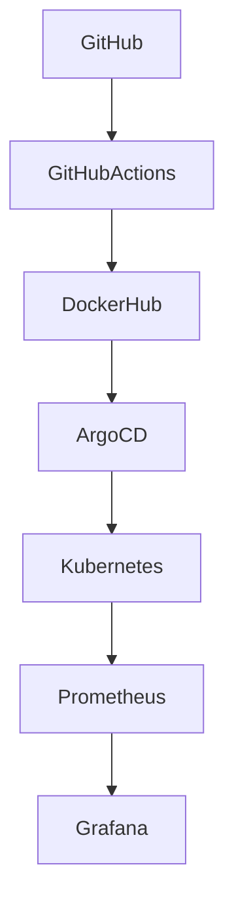
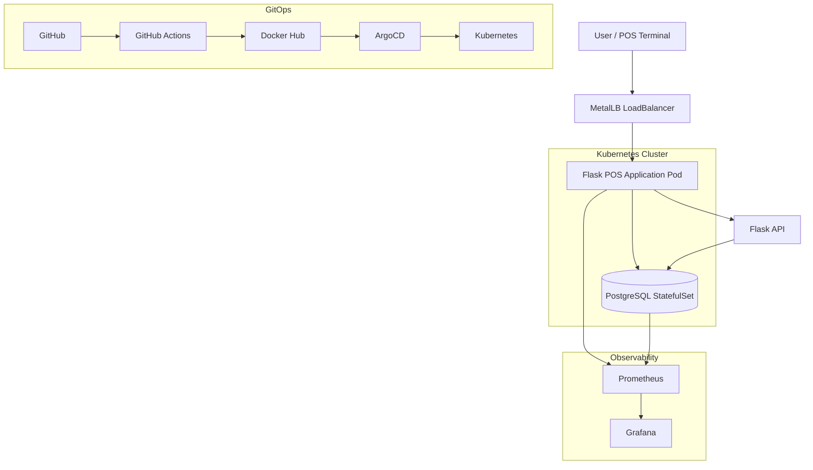
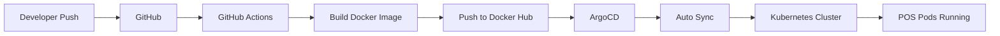
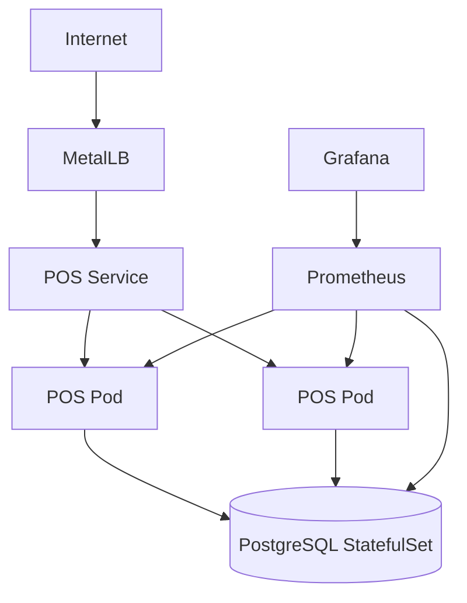
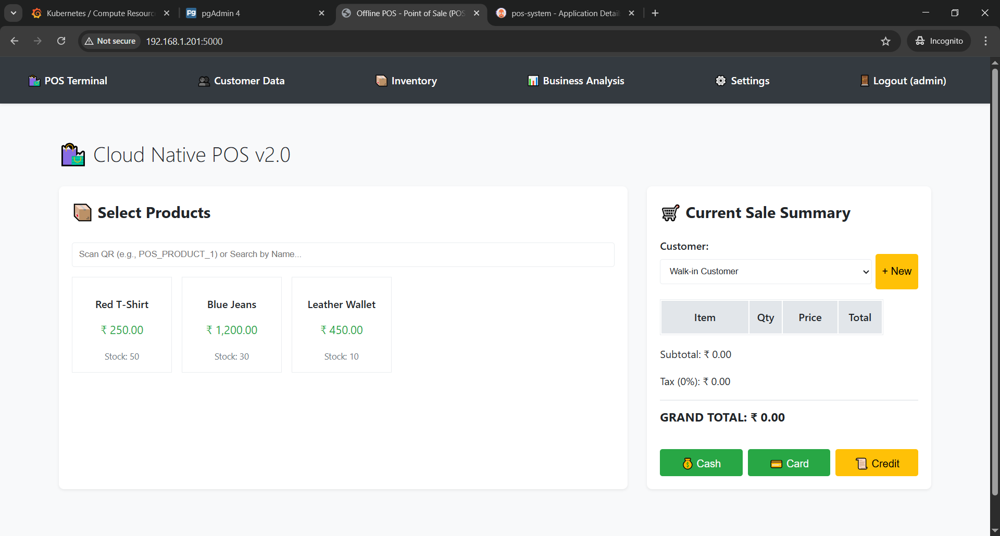
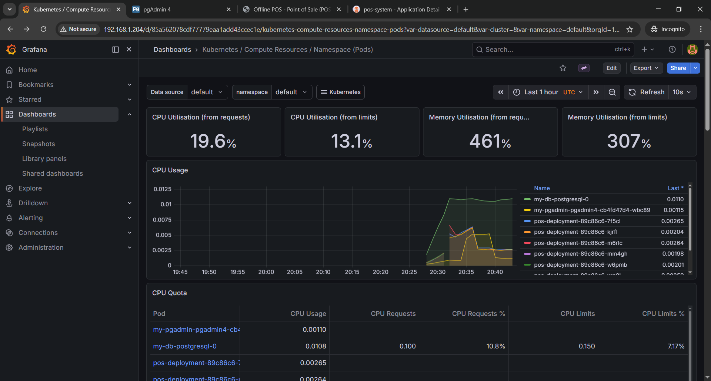
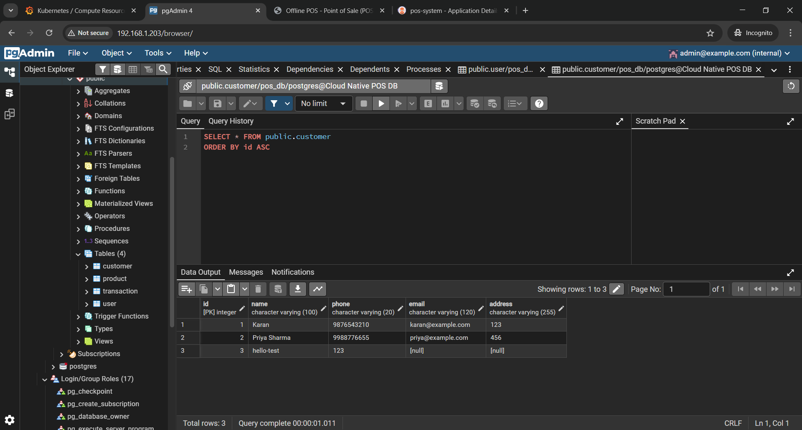
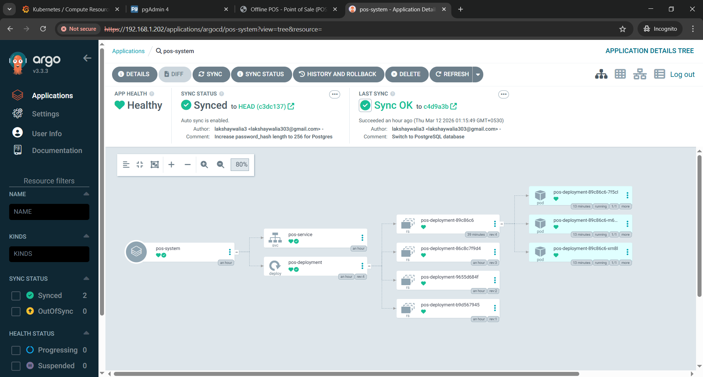

# 🚀 Enterprise Cloud-Native POS System


A highly available, stateful, and fully automated Point of Sale (POS) architecture deployed on a bare-metal Kubernetes cluster.

This project demonstrates the complete lifecycle of modernizing a Python/Flask monolith into a robust microservice architecture utilizing GitOps continuous deployment, stateful database sets, and live Prometheus telemetry.
## 🧠 DevOps Control Plane


## 🏗️ System Architecture


## 🔁 CI/CD Pipeline


## ☸️ Kubernetes Deployment


---

# 🏗️ System Architecture & Tech Stack

## 1. Application & Data Layer

| Component | Technology | Description |
| :--- | :--- | :--- |
| **Frontend/UI** | HTML5, Jinja2, Bootstrap | Responsive user interface for POS operations |
| **Backend API** | Python 3.10, Flask | Core application logic and routing |
| **ORM / Driver** | SQLAlchemy, `psycopg2` | Object-Relational Mapping for database |
| **Database** | PostgreSQL | Stateful storage for users, inventory, and sales |

---

## 2. Infrastructure & Orchestration Layer

| Component | Technology | Description |
| :--- | :--- | :--- |
| **Container Engine** | Docker | Packaging application into immutable images |
| **Container Registry** | Docker Hub | Remote repository for versioned container images |
| **Orchestration** | Kubernetes (K3s) | Container management, scaling, load balancing |
| **Package Manager** | Helm v3 | Templating and deploying Kubernetes resources |
| **Networking** | MetalLB | LoadBalancer IPs for bare-metal clusters |

---

## 3. CI/CD & Observability (Control Room)

| Component | Technology | Description |
| :--- | :--- | :--- |
| **Continuous Integration** | GitHub Actions | Automated pipeline for building and pushing images |
| **Continuous Deployment** | ArgoCD | GitOps controller syncing cluster state with Git |
| **Metrics Scraper** | Prometheus | Collects CPU, memory, and network metrics |
| **Data Visualization** | Grafana | Dashboards for monitoring cluster health |
| **Database GUI** | pgAdmin4 | Web interface for PostgreSQL administration |

---

# ⚙️ Service Endpoints & Access Guide

After deployment, services will be accessible via MetalLB IPs.

| Service | Protocol | Example IP | Credentials |
| :--- | :--- | :--- | :--- |
| POS Application | HTTP | `192.168.1.201` | Port `5000` |
| pgAdmin4 | HTTP | `192.168.1.203` | admin@example.com / adminpass123 |
| Grafana | HTTP | `192.168.1.204` | admin / adminpass123 |
| PostgreSQL | TCP | Internal DNS | postgres / pospassword123 |

---

# 🚀 Step-by-Step Deployment

## Prerequisites

- Kubernetes cluster (K3s, Minikube, or K8s)
- `kubectl`
- `helm`
- MetalLB installed

---

# Step 1: Continuous Integration (GitHub Actions)

Pipeline located in:

```
.github/workflows/docker-build.yml
```

Every push to `main` will:

1. Checkout repository
2. Login to Docker Hub
3. Build Docker image
4. Push image to Docker Hub

No manual commands required.

```
git push origin main
```

---

# Step 2: Stateful Database Setup (PostgreSQL)

```bash
helm repo add bitnami https://charts.bitnami.com/bitnami
helm repo update

helm install my-db bitnami/postgresql \
  --set auth.postgresPassword=pospassword123 \
  --set auth.database=pos_db
```

---

# Step 3: Database Admin (pgAdmin4)

```bash
helm repo add runix https://helm.runix.net
helm repo update

helm install my-pgadmin runix/pgadmin4 \
  --namespace default \
  --set service.type=LoadBalancer \
  --set env.email=admin@example.com \
  --set env.password=adminpass123
```

Connect pgAdmin to:

```
my-db-postgresql.default.svc.cluster.local
Port: 5432
```

---

# Step 4: Continuous Deployment (ArgoCD)

```bash
kubectl create namespace argocd

kubectl apply -n argocd \
-f https://raw.githubusercontent.com/argoproj/argo-cd/stable/manifests/install.yaml
```

Expose UI:

```bash
kubectl patch svc argocd-server \
-n argocd \
-p '{"spec": {"type": "LoadBalancer"}}'
```

Retrieve admin password:

```bash
kubectl -n argocd get secret argocd-initial-admin-secret \
-o jsonpath="{.data.password}" | base64 -d
```

Then create an ArgoCD application pointing to this repository.

Enable **Auto Sync**.

---

# Step 5: Deploy Application (Manual Helm)

```bash
cd cloud-native-pos

helm install pos-system ./my-pos-chart
```

Force pod refresh if image updated:

```bash
kubectl rollout restart deployment pos-deployment
```

---

# Step 6: Monitoring (Prometheus + Grafana)

```bash
helm repo add prometheus-community https://prometheus-community.github.io/helm-charts
helm repo update

helm install my-monitoring prometheus-community/kube-prometheus-stack \
  --namespace monitoring \
  --create-namespace \
  --set grafana.service.type=LoadBalancer \
  --set grafana.adminPassword=adminpass123
```

Access Grafana using the assigned MetalLB IP.

Navigate to:

```
Kubernetes / Compute Resources / Namespace (Pods)
```
# 📸 Project Demo

## POS Application Interface



---

## 📊 Grafana Monitoring Dashboard



Shows:

- Pod CPU usage
- Memory consumption
- Cluster health
- Namespace resource allocation

---

## 🗄️ PostgreSQL Database (pgAdmin)



Database tables include:

- users
- inventory
- sales
- transactions

---

## 🔄 ArgoCD GitOps Deployment



ArgoCD ensures:

- Git repository = cluster state
- Automatic deployments
- Rollback support
- Continuous synchronization
---

# 🛠️ Engineering Challenges & Fixes

| Component | Issue | Root Cause | Resolution |
| :--- | :--- | :--- | :--- |
| PostgreSQL | StringDataRightTruncation | SQLite ignored string limits | Increased SQLAlchemy column to `String(256)` |
| pgAdmin | CrashLoopBackOff | `.local` email rejected | Changed to `admin@example.com` |
| Docker | psycopg2 build failure | Missing gcc & libpq-dev | Added dependencies or used multi-stage build |
| ArgoCD | Pods not updating | Image tag unchanged | Used `imagePullPolicy: Always` |
| Grafana | 400% memory usage | Missing resource limits | Added CPU/memory requests |

---
---

# 👨‍💻 Author

### Lakshay Walia

Cloud & DevOps Engineer passionate about building **scalable cloud-native infrastructure, Kubernetes platforms, and automated CI/CD systems**.

**Tech Focus**

- Kubernetes
- Docker
- GitOps (ArgoCD)
- CI/CD (GitHub Actions)
- Observability (Prometheus + Grafana)
- PostgreSQL


# 📌 Project Goals

This repository demonstrates real-world **cloud-native DevOps engineering**, including:

- Containerization
- Kubernetes orchestration
- GitOps workflows
- Stateful database deployments
- Observability and monitoring

It represents a full **production-style architecture blueprint** for modern DevOps systems.

---

⭐ **Built with ❤️ by Lakshay Walia**

---
